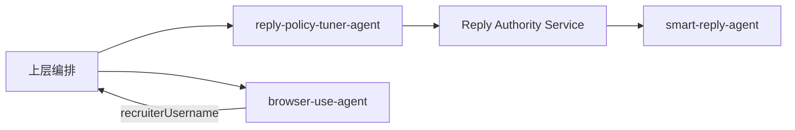

# reply-policy-tuner-agent

[](https://www.npmjs.com/package/@roll-agent/reply-policy-tuner-agent)
[](https://github.com/daixueyun3377/reply-policy-tuner-agent)
[](https://github.com/daixueyun3377/reply-policy-tuner-agent/issues)

> 基于 Roll Agent SDK 的回复策略 RSI 编排 Agent：校验 → 预览 → 双路评估 → 有条件写入，对接 Reply Authority Service（RAS）。

**npm 包：** [`@roll-agent/reply-policy-tuner-agent`](https://www.npmjs.com/package/@roll-agent/reply-policy-tuner-agent)

---

## 目录

- [简介](#简介)
- [特性](#特性)
- [环境要求](#环境要求)
- [安装](#安装)
- [使用](#使用)
- [配置](#配置)
- [Tools](#tools)
- [架构](#架构)
- [工作流](#工作流)
- [本地开发](#本地开发)
- [文档](#文档)
- [相关项目](#相关项目)
- [参与贡献](#参与贡献)

---

## 简介

本仓库实现一个通过 **stdio** 与上层通信的 Roll Agent，用 MCP Tool 管理租户级**回复策略**（读取、补丁校验、话术预览、双路评估、有条件写入）。策略变更须先经 RAS 评估；`update_policy` 受本地 **evaluate 门禁**约束，避免跳过安全评估直接落库。

本 Agent **不**自动驱动完整 RSI 阶段，而是向**上层编排**返回 `orchestration`，由编排方根据 `orchestration.action` 分支调度。

| 范围内 | 范围外 |
|--------|--------|
| 策略 CRUD、校验、预览、评估、有条件写入 | 向候选人发消息、解析 BOSS DOM |
| `orchestration`、evaluate 门禁、口语化错误 | 代替运营做「是否写入」的最终决策 |
| 与 RAS 集成 | 自动串联 browser-use / 多 Agent 全流程 |

## 特性

- **12 个 MCP Tools**：从 `diagnostic_status` 到 `reset_policy`
- **Evaluate 门禁**：评估成功后须在 TTL 内（默认 15 分钟）方可 `update_policy`
- **编排信号**：`submit_evaluate_policy_patch` 返回 `orchestration.action`
- **聚焦评估**：固定 1 条 primary + 1～2 条 regression，默认 1 条 related（修改相关）+ 1 条 general（通用观察）
- **Judge 固定开启**：Hard Gate + Fact Verification + Frozen Rubric Judge
- **两次文字确认**：预览后回复「确认评估」；评估后回复「确认保存」或「取消」，不依赖按钮
- **运营可读输出**：`operatorSummary`、`evaluationSummaryMarkdown`、对比表

## 环境要求

- [roll](https://www.npmjs.com/package/roll) CLI
- 可访问的 **Reply Authority Service** 与有效 Bearer Token（含所需 `reply-policy:*` scope）

## 安装

### 1. 安装 Agent

```bash
roll agent install @roll-agent/reply-policy-tuner-agent
```

### 2. 配置 `roll.config.yaml`

在 Roll 配置中为 `reply-policy-tuner-agent` 注入环境变量（必填项见 [配置](#配置)）：

```yaml
agents:
  env:
    reply-policy-tuner-agent:
      REPLY_AUTHORITY_URL: https://reply-authority.example.com
      REPLY_AUTHORITY_BEARER_TOKEN: 你的Token
      REPLY_AUTHORITY_TIMEOUT_MS: "120000"
```

### 3. 验证安装

```bash
roll agent list
roll run reply-policy-tuner-agent diagnostic_status --json
```

## 使用

### 读取策略

```bash
roll run reply-policy-tuner-agent get_policy \
  --input-json '{"tenantId":"<your-tenant-id>"}' --json
```

### 查看 Tool Schema

```bash
roll agent tools reply-policy-tuner-agent --json
```

### 多 Agent 路由

```bash
roll ask "评估并修改回复策略，先查账号再 evaluate" --json
```

典型改策流程（编排层负责 browser-use 与用户确认）：

```text
默认：当前 BOSS 账号 → resolve_recruiter_binding → 自动取得 tenantId
修改他人：diagnostic_status → 仅展示 Token 可管理租户 → 用户选择
→ get_policy（完整策略）
→ 内部检查并消除当前策略与候选方案的语义冲突
→ validate_patch → preview_policy_effect
  → [用户确认评估]
  → build_evaluate_cases → submit_evaluate_policy_patch
  → [展示评估结果]
  → update_policy 返回 needs_confirmation
  → [用户回复「确认保存」] → 上层合并内部 retryInput 重试写入
```

门禁细则、租户解析、硬阻断话术：见 [SKILL.md](./SKILL.md)、[references/orchestration.md](./references/orchestration.md)。

## 配置

环境变量通过 `roll.config.yaml` → `agents.env.reply-policy-tuner-agent` 注入（示例见 [安装](#安装)）。

| 变量 | 必填 | 说明 |
|------|:----:|------|
| `REPLY_AUTHORITY_URL` | 是 | RAS 基础地址 |
| `REPLY_AUTHORITY_BEARER_TOKEN` | 是 | Bearer Token |
| `REPLY_AUTHORITY_TIMEOUT_MS` | 否 | 一般请求超时，默认 `30000` ms；示例中为 `120000` |
| `REPLY_AUTHORITY_EVALUATE_TIMEOUT_MS` | 否 | 默认 `60000` ms |
| `REPLY_POLICY_TUNER_POLICY_JSON` | 否 | Tool 策略、`approvalTtlMs`、`evaluateGateTtlMs` |
| `REPLY_POLICY_TUNER_EVALUATE_GATE_DIR` | 否 | 门禁存储目录（默认 `~/.roll-agent/...`） |
| `REPLY_POLICY_TUNER_APPROVAL_DIR` | 否 | `needs_confirmation` 批准目录 |
| `REPLY_POLICY_TUNER_PREVIEW_RECRUITER_USERNAME` | 否 | 仅作后备；生产应由编排层传入 `recruiterUsername` |

Roll 环境声明：[`references/env.yaml`](./references/env.yaml)。

**常用 scope**（`diagnostic_status` 可查）：`reply-policy:read`、`validate`、`preview`、`write`；Judge 需 `reply-policy:judge`。

## Tools

| Tool | 说明 |
|------|------|
| `diagnostic_status` | 环境指纹、RAS 健康、auth context、Admin 租户列表 |
| `get_policy` | 当前策略 + `policyVersion` + 运营摘要 |
| `validate_patch` | 校验补丁；diff + warnings |
| `resolve_recruiter_binding` | BOSS 账号 ↔ 租户（含权限校验） |
| `build_evaluate_cases` | 用 preview 的 `sampleMessage` 锁定唯一目标 primary，拼装聚焦 evaluate 请求 |
| `submit_evaluate_policy_patch` | 双路回放 + Judge；写入门禁；返回 `orchestration` |
| `preview_policy_effect` | 单条话术预览 |
| `format_policy_preview` | 合并运营可读 Markdown |
| `update_policy` | 局部写入（evaluate 门禁 + 强制文字保存确认；显式 `deny` 仍优先） |
| `validate_policy` | 整份草稿校验（边缘场景） |
| `reset_policy` | 删除租户覆盖（`confirm`，不经 evaluate 门禁） |

## 架构



| 组件 | 职责 |
|------|------|
| **上层编排** | 多 Agent 串联、用户确认、`orchestration` 分支 |
| **reply-policy-tuner-agent** | MCP Tools、门禁存储、呈现层 |
| **browser-use-agent** | 默认获取当前 BOSS 账号；修改他人策略时获取目标租户对应账号 |
| **RAS** | 策略存储与 validate / preview / evaluate API |
| **smart-reply-agent** | 运行时消费已发布策略 |

**运行时：** `stdio` 传输、`on-demand` 拉起，入口 `node dist/index.js`（见 `package.json` → `rollAgent`）。

### 目录结构

```text
reply-policy-tuner-agent/
├── src/
│   ├── index.ts                 # Agent 入口与 Tool 注册
│   ├── tools/                   # MCP Tool 实现
│   ├── services/                # RAS 客户端、绑定解析
│   ├── presentation/            # 摘要、编排推导
│   └── evaluate-publish-gate.ts # 本地 evaluate 门禁
├── references/
│   ├── env.yaml                 # Roll 环境声明
│   └── orchestration.md         # 上层编排手册
├── SKILL.md                     # Agent Skill（门禁、运营话术）
├── dist/                        # 构建产物（npm 发布）
└── package.json
```

## 工作流

### 发布门禁（`update_policy` 不可绕过）

1. 对同一 `tenantId`、`basePolicyVersion`、`patch` 成功执行 `submit_evaluate_policy_patch`
2. `publishBlocked === false`；新增 Hard 始终阻塞，新增 Fact 仅在 primary/related 中阻塞
3. 门禁记录在 `evaluateGateTtlMs` 内有效（默认 15 分钟）
4. 写入的 patch 与最近一次 evaluate 完全一致

### `orchestration.action`

| 值 | 含义 |
|----|------|
| `rollback_to_propose` | Hard / Fact 硬阻断，须改 patch 后重评 |
| `decide_with_warnings` | 本次无新增 Hard/Fact 阻塞，展示 Judge 告警后可请求文字保存确认 |
| `ready_to_publish` | 评估通过，展示结果后请求文字保存确认 |

### 评估默认行为

- 固定 **1 条 primary**，必须复用本次 preview 或用户明确提出的问题
- 必须有 **1～2 条 regression**，至少 1 条 related；默认生成 1 条 related + 1 条 general
- primary/related 中新增 Hard/Fact 问题可阻塞；general 中新增 Hard 阻塞、新增 Fact 只告警
- 所有样本都采用 base/draft 增量判定；历史已有问题只告警
- 超时：优先保留目标 primary + 1 条 related regression 重试一次；仍失败则报错

## 本地开发

从源码构建（需 [Node.js](https://nodejs.org/) **>= 22.6.0** 与 pnpm）：

```bash
git clone https://github.com/daixueyun3377/reply-policy-tuner-agent.git
cd reply-policy-tuner-agent
pnpm install
pnpm build
```

```bash
pnpm dev          # 运行 TS 入口（Node --experimental-strip-types）
pnpm typecheck
pnpm test
pnpm build        # 声明 + esbuild 打包 + 混淆 → dist/
pnpm clean
```

对接真实 RAS 的联调测试：

```bash
REPLY_POLICY_TUNER_LIVE_TEST=1 pnpm test
```

## 文档

| 文档 | 读者 |
|------|------|
| [SKILL.md](./SKILL.md) | 编排 / 子 Agent：门禁、话术、patch 方法论 |
| [references/orchestration.md](./references/orchestration.md) | 上层编排：调用顺序、`needs_confirmation` |
| [references/env.yaml](./references/env.yaml) | Roll 环境变量 |
| [CHANGELOG.md](./CHANGELOG.md) | 版本记录 |

## 相关项目

- [@roll-agent/sdk](https://www.npmjs.com/package/@roll-agent/sdk) — Roll Agent SDK
- **browser-use-agent** — BOSS `recruiterUsername`
- **smart-reply-agent** — 运行时回复消费已发布策略

## 参与贡献

欢迎提交 Issue 与 Pull Request。

1. Fork 本仓库
2. 创建功能分支（`git checkout -b feature/your-feature`）
3. 提交变更（`git commit -m 'Add some feature'`）
4. 推送分支（`git push origin feature/your-feature`）
5. 打开 [Pull Request](https://github.com/daixueyun3377/reply-policy-tuner-agent/compare)

较大改动建议先在 [Issues](https://github.com/daixueyun3377/reply-policy-tuner-agent/issues) 讨论。

---

<p align="center">
  <a href="https://github.com/daixueyun3377/reply-policy-tuner-agent">GitHub</a>
  ·
  <a href="https://github.com/daixueyun3377/reply-policy-tuner-agent/issues">Issues</a>
  ·
  <a href="https://www.npmjs.com/package/@roll-agent/reply-policy-tuner-agent">npm</a>
</p>
