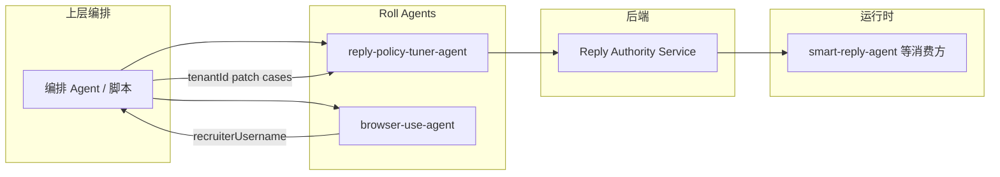

# Reply Policy Tuner Agent 设计文档

> 包名：`@roll-agent/reply-policy-tuner-agent`  
> 读者：需要理解实现与契约的开发者、编排方集成者。运营话术与逐步操作见 `SKILL.md`、`docs/ops-guide.md`、`references/orchestration.md`。

---

## 1. 定位与目标

本仓库实现一个基于 [Roll Agent SDK](https://www.npmjs.com/package/@roll-agent/sdk) 的 **stdio MCP Agent**，职责是围绕 **回复策略（Reply Policy）** 提供可编排的 Tool 能力：读取、校验、预览、双路评估、有条件写入与重置。

设计目标可归纳为三点：

| 目标 | 实现手段 |
|------|----------|
| 策略变更可验证 | 经 RAS（Reply Authority Service）做 validate / preview / evaluate，再允许写入 |
| 上层可机械分支 | `submit_evaluate_policy_patch` 返回 `orchestration`，不自动跳 RSI 阶段 |
| 写入不可绕过评估 | 本地 evaluate 门禁 + `update_policy` 的 confirm 策略 |

本 Agent **不负责**：向候选人发消息、解析 BOSS 页面 DOM、代替上层做多 Agent 串联。`recruiterUsername` 由 `browser-use-agent` 提供；完整 RSI 循环由上层编排执行。

---

## 2. 系统上下文



| 角色 | 关系 |
|------|------|
| 上层编排 | 选 tenant、调 browser-use、读 `orchestration`、在唯一写入点征求运营确认 |
| 本 Agent | 暴露 Tool、推导编排字段、持久化门禁与 approval |
| RAS | 策略存储、校验、回放推理、Hard/Fact/Judge |
| smart-reply-agent | 运行时消费已发布策略，与本 Agent 管理面分离 |

---

## 3. 代码结构

```
src/
├── index.ts                 # defineAgent + listen
├── types/reply-policy.ts    # Zod 领域类型（策略、评估、Admin）
├── services/
│   ├── reply-authority-client.ts   # RAS HTTP 封装
│   └── recruiter-binding.ts        # 招聘账号绑定解析
├── tools/                   # 各 defineTool 实现
├── presentation/            # 运营可读摘要、编排推导、对比 Markdown
├── evaluate-publish-gate.ts # evaluate → update 门禁存储与校验
├── policy.ts                # REPLY_POLICY_TUNER_POLICY_JSON 与 confirm/deny
├── tool-action-approval.ts  # needs_confirmation 一次性批准
├── dangerous-patch.ts       # 高危 patch 检测
├── diagnostics/effective-env.ts
└── store-cleanup.ts         # 过期文件概率清理
```

**依赖方向**：`tools` → `services` / `presentation` / 门禁模块；`presentation` 不调用 RAS；类型定义被全栈复用。

**构建**：`tsc` 声明 + `esbuild` bundle + `terser` 混淆，入口 `dist/index.js`；Roll 元数据在 `package.json` 的 `rollAgent` 段。

---

## 4. 回复策略领域模型

策略全文由 `ReplyPolicyConfigSchema`（`src/types/reply-policy.ts`）描述，与 RAS 契约一致。模块划分如下：

| 模块 | 职责 |
|------|------|
| `persona` | 语气、长度、共情、称呼等人设 |
| `stageGoals` | 六阶段目标：`trust_building`、`private_channel`、`qualify_candidate`、`job_consultation`、`interview_scheduling`、`onboard_followup` |
| `industryVoices` + `defaultIndustryVoiceId` | 行业话术模板 |
| `hardConstraints` | 生成后拦截规则（severity） |
| `factGate` | 可核实声明、缺失事实时的 fallback 与禁止项 |
| `qualificationPolicy` | 资格判定（如年龄策略） |
| `outputGuards` | 提问上限、审计禁用语等 |

租户策略来源枚举：`tenant-file` | `global-file` | `default`。每次读取带 `policyVersion`，写入须携带匹配的 `basePolicyVersion`。

`get_policy` 在完整 JSON 之外生成 `operatorSummary`（`presentation/policy-summary.ts`），供子 Agent 对运营展示，编排层内部保留 `policyVersion` 作 `basePolicyVersion`。

---

## 5. RSI 阶段与 Tool 映射

RSI（Recursive Self-Improvement 在此处的落地）由上层驱动；本 Agent 只提供阶段能力，**不**自动从 Propose 跳到 Publish。

| 阶段 | 主要 Tool | 产出 |
|------|-----------|------|
| Resolve | `diagnostic_status`、`resolve_recruiter_binding` | `tenantId`、绑定校验、Admin 运营列表 |
| Inspect | `get_policy` | 当前策略 + `basePolicyVersion` |
| Propose | （上层生成 patch） | `Record<string, unknown>` patch |
| Validate | `validate_patch` | diff、warnings、合并后草稿 |
| Preview | `preview_policy_effect`、`format_policy_preview` | 单条话术 base/draft 对比 |
| Evaluate | `build_evaluate_cases` → `submit_evaluate_policy_patch` | 批量回放 + `orchestration` |
| Publish | `update_policy` | 落库（须过门禁与 confirm） |
| Reset | `reset_policy` | 删除租户覆盖（高危 confirm） |

边缘能力：`validate_policy`（整份草稿校验）。

**用户确认时序（架构约束）**：唯一落库确认发生在 evaluate 结果展示之后、调用 `update_policy` 之前；validate/preview 阶段的肯定不构成写入授权。该约束由 SKILL/编排文档约束上层；Tool 层用门禁与 `publish_not_allowed` 兜底。

---

## 6. 评估流水线

### 6.1 用例构建

`build_evaluate_cases`：

- 输入：`recruiterUsername`、1–5 条 case（`primary` / `regression`）。
- 若无 `regression`，在未满 5 条时自动追加默认问候回归样本 `regression-greeting-001`。
- 输出：带 `target`（`platform: zhipin`、绑定、合成 `conversationId` / `candidateId`）的完整 case，供 evaluate 请求体使用。

推荐规模：2–3 条 primary + 1 条 regression（总计 3–4），以降低 RAS 双路 + Judge 耗时（默认 evaluate 超时 90s）。

### 6.2 RAS evaluate

`submit_evaluate_policy_patch` 调用 `POST .../reply-policy:evaluate`：

- `judge.enabled` **固定为 true**（与 SKILL 一致；无 scope 时由 RAS 403，非本 Agent 静默关闭）。
- 响应含每条 case 的 `base` / `draft` 回复、`comparison`、`factVerification`、`judge`。
- `summary` 分项：`hardRecommendedForPublish`、`factRecommendedForPublish`、`judgeRecommendedForPublish`、`recommendedForPublish`（三者合取）。

### 6.3 编排推导

`deriveEvaluationOrchestration`（`presentation/evaluation-orchestration.ts`）在 **本地** 根据 evaluate 响应计算 `orchestration`，上层必须以 `orchestration.action` 分支，不得仅用 `evaluationSummaryMarkdown` 做 if/else。

| `action` | 触发条件（简化） | `publishBlocked` |
|----------|------------------|------------------|
| `rollback_to_propose` | Hard 未过、draft 门控违规、Fact blocking、或兜底未达发布建议 | `true` |
| `decide_with_warnings` | Hard+Fact 已过，Judge/回归告警 | `false` |
| `ready_to_publish` | Hard+Fact+Judge 均过 | `false` |

附加字段：

- `mandatoryPublishReady`：Hard ∧ Fact（与 Judge 无关）。
- `judgeAdvisoryOnly`：仅 Judge 未过。
- `requiresExplicitPublishConfirmation`：可进入发布确认流程（仍未写入）。
- `guidance`：编排层可读的一句话（含硬阻断时的禁止绕过说明）。

同时生成 `evaluationSummaryMarkdown`（`presentation/evaluation-summary.ts`）仅用于展示。

### 6.4 评估后副作用

成功 evaluate 后调用 `recordEvaluatePublishGate`，键为 `tenantId:basePolicyVersion:sha256(patch)`，供后续 `update_policy` 校验。

---

## 7. 发布门禁（Evaluate Gate）

实现：`src/evaluate-publish-gate.ts`。

**存储**：`~/.roll-agent/reply-policy-tuner/evaluate-gates/<key>.json`（可通过 `REPLY_POLICY_TUNER_EVALUATE_GATE_DIR` 覆盖）。

**记录字段**：`patchDigest`、`hard/fact/recommended`、`publishBlocked`、`orchestrationAction`、`evaluatedAtMs`、`draftPolicyVersion`。

**TTL**：`REPLY_POLICY_TUNER_POLICY_JSON.evaluateGateTtlMs`（默认 15 分钟）。

`update_policy` 调用 `assertEvaluatePublishGateAllowsUpdate`，失败抛出 `StructuredToolError`，`code: publish_not_allowed`，`message` 为运营可读文案（`evaluate-publish-gate-messages.ts`），`details.reason` 供编排排查：

| reason | 含义 |
|--------|------|
| `missing_evaluate` | 无匹配评估记录 |
| `expired` | 记录超时 |
| `mismatch` | tenant/version/patch 与记录不一致 |
| `hard_block` | `publishBlocked === true` |
| `not_recommended` | Hard 或 Fact 分项未通过 |

**编排层与 Tool 层关系**：上层应满足 `!publishBlocked && hard && fact && 用户确认`；Tool 不校验 Judge，故 `decide_with_warnings` 在 Hard/Fact 通过后仍可写入（若 evaluate 记录允许）。

---

## 8. Tool 级策略与二次确认

`REPLY_POLICY_TUNER_POLICY_JSON` 解析为 `TunerPolicyConfig`（`policy.ts`）：

| 字段 | 默认 | 作用 |
|------|------|------|
| `approvalTtlMs` | 300000 | `needs_confirmation` 批准 ID 有效期 |
| `evaluateGateTtlMs` | 900000 | evaluate 门禁 TTL |
| `tools.<name>.policy` | `update_policy`/`reset_policy` 为 `confirm` | `log` / `deny` / `confirm` |

`assertTunerToolAllowed` 行为：

- `log`：直接执行。
- `deny`：`action_denied`。
- `confirm`：无 `toolActionApproval` 时抛 `needs_confirmation`（含 `approvalRequest`）；有则校验一次性 ID（`tool-action-approval.ts`，文件 + 内存缓存）。

`update_policy` 在 RAS 写入成功后才 `consumeApproval`；高危 patch 由 `dangerous-patch.ts` 标记并写入 confirm 摘要。

---

## 9. Tool 目录

| Tool | RAS / 本地 | 要点 |
|------|------------|------|
| `diagnostic_status` | health + auth/context + admin/tenants | 输出 scopes 能力矩阵、tenantIds、Admin 运营列表 |
| `get_policy` | GET reply-policy | `operatorSummary` |
| `validate_patch` | validate-patch | diff、合并策略 |
| `resolve_recruiter_binding` | 绑定查询 | evaluate/preview 前校验；按人名反查 tenant |
| `build_evaluate_cases` | 本地拼装 | 自动 regression |
| `submit_evaluate_policy_patch` | evaluate | 写门禁 + `orchestration` |
| `preview_policy_effect` | preview | 单条话术对比 |
| `format_policy_preview` | 本地 | Markdown 汇总 |
| `update_policy` | PATCH | 门禁 + confirm |
| `validate_policy` | validate 整稿 | 边缘 |
| `reset_policy` | DELETE | confirm |

HTTP 错误经 `ras-errors.ts` 转为可抛消息；响应体经 Zod 校验。

---

## 10. 对外呈现层

`presentation/` 将机器结构转为运营或编排可用的视图，与 Tool 业务逻辑分离：

| 模块 | 输出 |
|------|------|
| `policy-summary.ts` | `operatorSummary` |
| `policy-path-labels.ts`、`labels.ts` | 字段中文标签 |
| `comparison.ts` | patch 话术表格式对比 |
| `evaluation-summary.ts` | 评估 Markdown |
| `evaluation-orchestration.ts` | `orchestration` 结构 |

原则：分支决策读 `orchestration`；Markdown 仅展示。子 Agent 不向运营暴露 `tenantId`、`policyVersion`、tool 名、`details.*`。

---

## 11. 环境与部署

必填（`references/env.yaml`）：

- `REPLY_AUTHORITY_URL`
- `REPLY_AUTHORITY_BEARER_TOKEN`

可选：

- `REPLY_AUTHORITY_TIMEOUT_MS`（默认 30s）
- `REPLY_AUTHORITY_EVALUATE_TIMEOUT_MS`（evaluate 默认 90s）
- `REPLY_POLICY_TUNER_POLICY_JSON`
- `REPLY_POLICY_TUNER_EVALUATE_GATE_DIR` / `REPLY_POLICY_TUNER_APPROVAL_DIR`
- `REPLY_POLICY_TUNER_PREVIEW_RECRUITER_USERNAME`（非生产主路径）

运行：`node dist/index.js`，stdio transport，`ownership: on-demand`（`package.json` → `rollAgent`）。

---

## 12. 测试与质量

- 单元测试：编排推导、门禁消息、policy-summary、comparison、dangerous-patch 等（`src/**/*.test.ts`）。
- 集成：`integration/live-smoke.test.ts`（`REPLY_POLICY_TUNER_LIVE_TEST=1` 时连真实 RAS）。

---

## 13. 文档分工

| 文档 | 用途 |
|------|------|
| 本文 `docs/design.md` | 架构、模块、契约、门禁机制 |
| `SKILL.md` | Agent 技能入口：编排必读、子 Agent 话术、反模式 |
| `references/orchestration.md` | 上层逐步编排、batch、`needs_confirmation` 示例 |
| `docs/ops-guide.md` | 运营联调与验收 |
| `references/env.yaml` | 环境变量声明 |

---

## 14. 扩展与约束备忘

- **Patch 影响面**：改生成行为须触及 `stageGoals` / `persona`，单靠 `hardConstraints` 只能兜底；见 SKILL「Patch 生成方法论」。
- **Fact 硬阻断**：不得通过删除 `forbiddenWhenMissingFacts` 或放宽 `factGate.mode` 规避；应改 RAS 门店证据或 patch/样本。
- **Judge scope**：`diagnostic_status` → `capabilities.canJudge`；无 scope 时 RAS 403，非本 Agent 侧关闭 Judge。
- **版本与发布**：npm `files` 含 `dist`、`SKILL.md`、`references`；源码通过 build 产出可分发的混淆 bundle。
